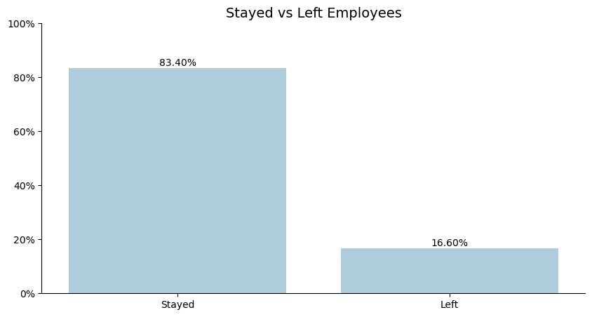
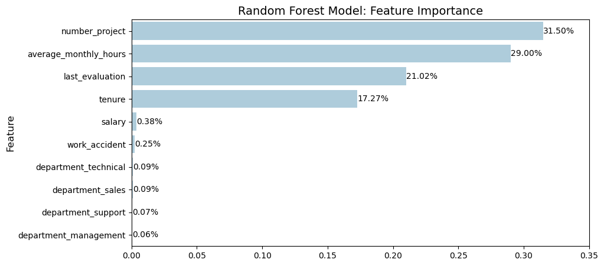

# Salifort Motors: Predicting Employee Churn

## Overview

This project aimed to develop a machine learning model, among four models (Logistic Regression, Decision Tree, Random Forest, and XGBoost), to predict whether or not an employee will leave the company. It utilized employee data collected from the HR department at the company. The final random forest model achieved a 91% recall and 92% precision in identifying the most important factors influencing employee churn. The model identified the number of projects, average monthly hours, the last evaluation score, and time spent at the company as the most significant factors differentiating leavers from non-leavers.

## Business Understanding

Salifort Motors, a leading global manufacturer of alternative energy vehicles (AEVs), is experiencing high employee turnover. This challenge disrupts workflows, hinders productivity, and leads to significant financial burdens due to recruitment and onboarding costs. Therefore, the HR department at Salifort Motors wants to take some initiatives to improve employee satisfaction levels at the company. It is important to understand what factors contribute to their leaving in order to help the company develop appropiate solutions to increase employee retention.

## Data Understanding

The employee survey data came from [Kaggle](https://www.kaggle.com/datasets/mfaisalqureshi/hr-analytics-and-job-prediction?select=HR_comma_sep.csv). The data consisted of approximately 14,999 different employee's self-reported survey responses and 10 features. The features included information on satisfactory level, number of project, average monthly hours, time spend company, promotion in the last 5 years, department, and salary rate. The bar chart below shows the breakdown of how many leavers and non-leavers exist in the data set.

In connection to this, categorical features, such as salary and department, were encoded into dummy variables. Some columns were dropped and reformatted into the proper data type.

## Modeling and Evaluation

A random forest model comprising 100 decision trees was used to determine feature importance in who would leave the company or not. The below plot shows that the number of projects, average monthly hours, the last evaluation score were the top 3 most important factors in determining a leaver from a non-leaver. The overall model performed with 91% recall and 92% precision. 

## Conclusion

This model can benefit Salifort Motors in knowing if employees will leave the company or not. In the future, removing the last evaluation score and adding more information on a time-varying deatures relating to the employee’s behavior may also be beneficial in helping the stakeholder address their business problem.